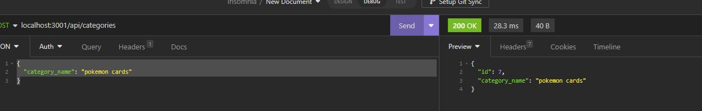

 
# UW-BootCamp-Week_13-ORM-Backend-4-EStore

## Description

I created this aplacation to practice with sequlize models, api calls and to further practice with mysql and sequlize. the practice situation is for an imaganary e store databace where you can acces catagorires, products , and tags  in a way that you would see if you were online shopping just in the backend. i learned how to call sequlize models and combine data in calls more effeciently.

## Table of Contents (Optional)

- [Installation](#installation)
- [Usage](#usage)
- [License](#license)

## Installation

to run this aplaction run a npm i after dowloading the code from the resposatory. then download and start a mysql server, and download and setup insomina. after that create a .env file with the db name, the db password and db user. the formationg can be found in the dot connection.js folder or by using google. then seed the data base and run a npm start.

## Usage

To use this aplaction follow the install, otherwise you can do get, post, put, and delete functions using insomina.

;

video: https://youtu.be/BnmiTLGyJBc 

## License

Copyright 2023, 

    Permission is hereby granted, free of charge, to any person obtaining a copy of this software and associated documentation files (the “Software”), to deal in the Software without 
    restriction, including without limitation the rights to use, copy, modify, merge, publish, distribute, sublicense, and/or sell copies of the Software, and to permit persons to whom 
    the Software is furnished to do so,subject to the following conditions:
    The above copyright notice and this permission notice shall be included in all copies or substantial portions of the Software.
    THE SOFTWARE IS PROVIDED “AS IS”, WITHOUT WARRANTY OF ANY KIND, EXPRESS OR IMPLIED, INCLUDING BUT NOT LIMITED TO THE WARRANTIES OF MERCHANTABILITY, FITNESS FOR A PARTICULAR PURPOSE 
    AND NONINFRINGEMENT. IN NO EVENT SHALL THE AUTHORS OR COPYRIGHT HOLDERS BE LIABLE FOR ANY CLAIM, DAMAGES OR OTHER LIABILITY, WHETHER IN AN ACTION OF CONTRACT, TORT OR OTHERWISE, 
    ARISING FROM, OUT OF OR IN CONNECTION WITH THE SOFTWARE OR THE USE OR OTHER DEALINGS IN THE SOFTWARE.
(https://opensource.org/licenses/MIT)

